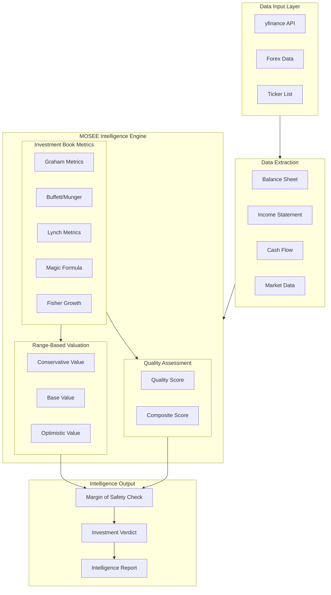
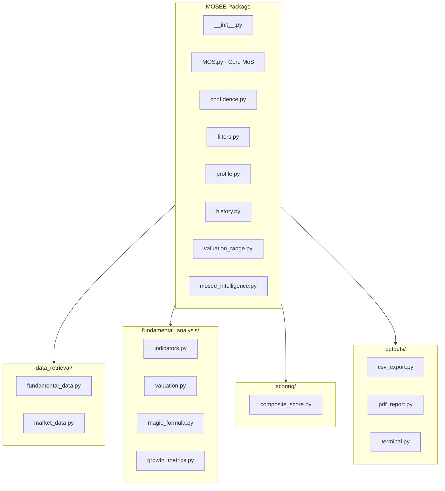
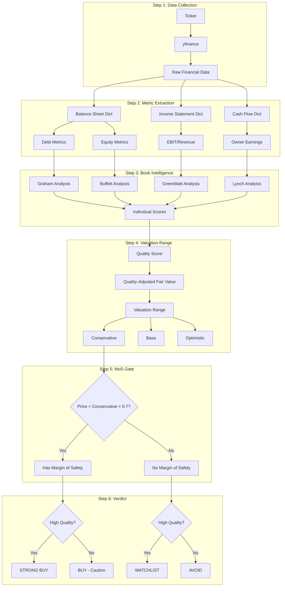

# MOSEE System Architecture

## Overview

MOSEE is designed as a modular system where each component handles a specific aspect of investment analysis. Data flows from raw financial statements through multiple analysis layers to produce intelligent investment recommendations.

## System Architecture Diagram



## File Structure

```
MOSEE/
├── __init__.py                 # Main package exports
├── MOS.py                      # Core margin of safety calculations
├── confidence.py               # Data quality scoring
├── filters.py                  # Stock filtering
├── profile.py                  # Investment profile building
├── history.py                  # Historical tracking
├── valuation_range.py          # Range-based valuations
├── mosee_intelligence.py       # Smart verdict engine
│
├── data_retrieval/
│   ├── fundamental_data.py     # Financial statement extraction
│   └── market_data.py          # Price and market cap data
│
├── fundamental_analysis/
│   ├── indicators.py           # Graham, Buffett, Lynch metrics
│   ├── valuation.py            # DCF, PAD, Book value
│   ├── magic_formula.py        # Greenblatt's formula
│   └── growth_metrics.py       # Fisher growth analysis
│
├── scoring/
│   └── composite_score.py      # Multi-factor scoring
│
└── outputs/
    ├── csv_export.py           # CSV output
    ├── pdf_report.py           # PDF reports
    └── terminal.py             # Terminal display
```

## Module Structure Diagram



## Data Flow



## Key Components

### 1. Data Retrieval Layer
- Downloads financial statements from yfinance (FREE)
- Handles currency conversion via forex_python
- Extracts and normalizes data fields

### 2. Fundamental Analysis Layer
- Calculates metrics from each investment philosophy
- Produces individual scores per methodology
- Handles missing data gracefully

### 3. Valuation Layer
- Creates range-based valuations (not single points)
- Adjusts for quality and predictability
- Triangulates multiple valuation methods

### 4. Intelligence Layer
- Combines all inputs into final verdict
- Enforces margin of safety requirement
- Generates actionable recommendations

### 5. Output Layer
- CSV exports for spreadsheet analysis
- PDF reports for presentation
- Terminal output for quick review
