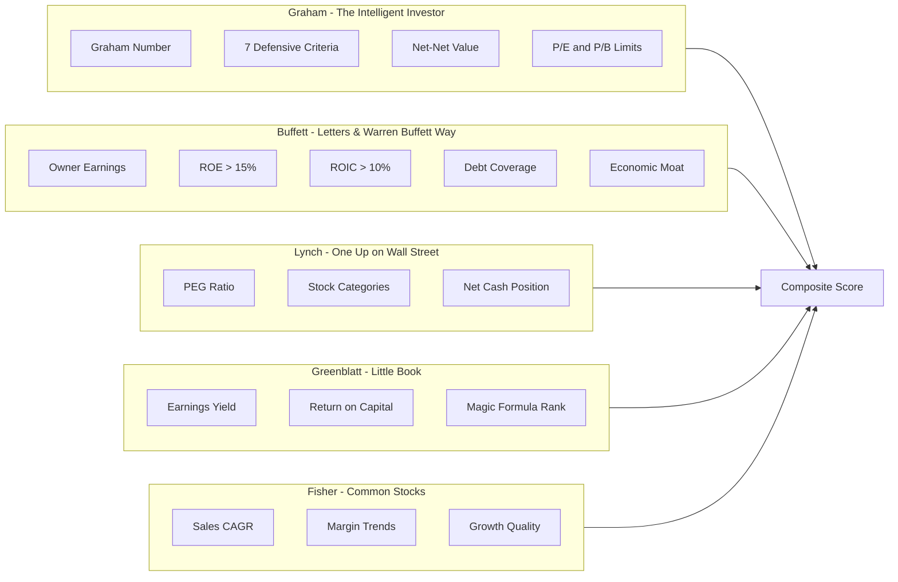

# Investment Book Intelligence

MOSEE integrates quantitative screening criteria from classic value investing books. This document details the metrics derived from each source.

## Overview Diagram



---

## Benjamin Graham
**Source:** The Intelligent Investor, Security Analysis

Graham is the father of value investing and taught Warren Buffett. His approach focuses on buying stocks with a significant margin of safety.

### Graham Number
The maximum price a defensive investor should pay:

```
Graham Number = √(22.5 × EPS × Book Value Per Share)
```

The 22.5 comes from Graham's criteria:
- P/E should not exceed 15
- P/B should not exceed 1.5
- Therefore P/E × P/B ≤ 22.5

### Graham's 7 Defensive Criteria

| # | Criterion | Threshold |
|---|-----------|-----------|
| 1 | Adequate Size | Revenue > $500M |
| 2 | Strong Financial Condition | Current Ratio ≥ 2.0 |
| 3 | Earnings Stability | Positive earnings each of last 5 years |
| 4 | Dividend Record | Uninterrupted dividends for 5+ years |
| 5 | Earnings Growth | EPS growth ≥ 33% over 10 years |
| 6 | Moderate P/E | P/E ≤ 15 |
| 7 | Moderate P/B | P/B ≤ 1.5 (or P/E × P/B ≤ 22.5) |

**Score:** 0-7 (number of criteria passed)

### Implementation
```python
from MOSEE.fundamental_analysis.indicators import (
    calculate_graham_number,
    calculate_graham_defensive_criteria
)
```

---

## Warren Buffett / Charlie Munger
**Source:** Berkshire Hathaway Letters, The Warren Buffett Way, Poor Charlie's Almanack

Buffett evolved Graham's approach to focus on "wonderful companies at fair prices" rather than "fair companies at wonderful prices."

### Owner Earnings
Buffett's preferred measure of true earning power:

```
Owner Earnings = Net Income + Depreciation + Amortization - Average CapEx
```

This represents cash that owners could extract while maintaining competitive position.

### Return on Equity (ROE)
```
ROE = Net Income / Stockholders' Equity
```
**Target:** Consistent ROE > 15%

### Return on Invested Capital (ROIC)
```
ROIC = NOPAT / Invested Capital
```
**Target:** ROIC > 10% consistently

### Interest Coverage
```
Interest Coverage = EBIT / Interest Expense
```
**Target:** ≥ 5x for safety

### Key Thresholds

| Metric | Poor | Average | Good | Excellent |
|--------|------|---------|------|-----------|
| ROE | <8% | 8-12% | 12-18% | >18% |
| ROIC | <8% | 8-12% | 12-15% | >15% |
| Debt/Equity | >1.5 | 0.8-1.5 | 0.3-0.8 | <0.3 |
| Interest Coverage | <2x | 2-5x | 5-10x | >10x |

### Implementation
```python
from MOSEE.fundamental_analysis.indicators import (
    calculate_roe,
    calculate_roic,
    calculate_interest_coverage,
    calculate_debt_to_equity
)
from MOSEE.data_retrieval.fundamental_data import get_owners_earnings
```

---

## Peter Lynch
**Source:** One Up on Wall Street

Lynch focused on "growth at a reasonable price" (GARP) and categorizing stocks by their growth characteristics.

### PEG Ratio
```
PEG = P/E Ratio / (Earnings Growth Rate × 100)
```

| PEG | Interpretation |
|-----|----------------|
| < 0.5 | Very undervalued |
| 0.5-1.0 | Undervalued |
| 1.0-1.5 | Fair value |
| 1.5-2.0 | Overvalued |
| > 2.0 | Very overvalued |

### Lynch Stock Categories

| Category | Growth Rate | Description |
|----------|-------------|-------------|
| Slow Grower | < 5% | Utilities, mature companies |
| Stalwart | 5-12% | Large, stable companies |
| Fast Grower | > 12% | Smaller, aggressive growers |
| Cyclical | Varies | Tied to economic cycles |
| Turnaround | N/A | Recovering from problems |
| Asset Play | N/A | Hidden asset value |

### Net Cash Per Share
```
Net Cash Per Share = (Cash - Total Debt) / Shares Outstanding
```

Positive net cash provides safety and potential for buybacks/dividends.

### Implementation
```python
from MOSEE.fundamental_analysis.indicators import (
    calculate_peg_ratio,
    classify_lynch_category,
    calculate_net_cash_per_share,
    get_lynch_metrics
)
```

---

## Joel Greenblatt
**Source:** The Little Book That Beats the Market

Greenblatt's "Magic Formula" ranks stocks by combining cheapness and quality.

### Earnings Yield
```
Earnings Yield = EBIT / Enterprise Value

where:
Enterprise Value = Market Cap + Total Debt - Cash
```

Higher earnings yield = cheaper stock.

### Return on Capital
```
Return on Capital = EBIT / (Net Working Capital + Net Fixed Assets)
```

Higher ROC = better quality business.

### Magic Formula Ranking

1. Rank all stocks by Earnings Yield (highest = rank 1)
2. Rank all stocks by Return on Capital (highest = rank 1)
3. Combined Rank = EY Rank + ROC Rank
4. **Lower combined rank = better investment**

### Implementation
```python
from MOSEE.fundamental_analysis.magic_formula import (
    calculate_earnings_yield,
    calculate_return_on_capital,
    calculate_magic_formula_metrics,
    rank_by_magic_formula
)
```

---

## Philip Fisher
**Source:** Common Stocks and Uncommon Profits

Fisher focused on growth investing - finding companies with sustainable competitive advantages and strong growth.

### Sales Growth (CAGR)
```
CAGR = (End Value / Start Value)^(1/years) - 1
```

| CAGR | Rating |
|------|--------|
| > 15% | Excellent |
| 10-15% | Strong |
| 5-10% | Moderate |
| < 5% | Slow |

### Margin Trend Analysis
Track gross margin and operating margin over time:
- **Improving:** Indicates strengthening competitive position
- **Stable:** Maintaining position
- **Declining:** Potential competitive issues

### Growth Quality Score
Combines:
- Sales growth rate (40%)
- Margin trend (30%)
- Growth consistency (20%)
- ROE bonus (10%)

### Implementation
```python
from MOSEE.fundamental_analysis.growth_metrics import (
    calculate_sales_cagr,
    calculate_margin_trend,
    get_fisher_metrics
)
```

---

## Seth Klarman
**Source:** Margin of Safety

Klarman's philosophy permeates all of MOSEE:

1. **Multiple Valuation Methods** - Don't rely on single estimate
2. **Conservative Assumptions** - Use pessimistic scenarios
3. **Margin of Safety** - Only buy below conservative value
4. **Acknowledge Uncertainty** - Value is a range, not a point

---

## Composite Scoring

All philosophies are combined into a weighted composite score:

```python
MOSEE_composite = (
    graham_score * 0.20 +      # Safety / Value
    buffett_score * 0.25 +     # Quality / Moat
    lynch_score * 0.15 +       # Growth at reasonable price
    greenblatt_score * 0.20 +  # Combined value + quality
    fisher_score * 0.20        # Growth sustainability
)
```

Weights are configurable based on investment style preference.

### Investment Styles

| Style | Graham | Buffett | Lynch | Greenblatt | Fisher |
|-------|--------|---------|-------|------------|--------|
| Deep Value | 35% | 25% | 10% | 20% | 10% |
| Quality Value | 15% | 40% | 15% | 15% | 15% |
| GARP | 15% | 20% | 35% | 10% | 20% |
| Magic Formula | 10% | 15% | 15% | 45% | 15% |
| Growth | 10% | 15% | 25% | 10% | 40% |
| Balanced | 20% | 20% | 20% | 20% | 20% |
