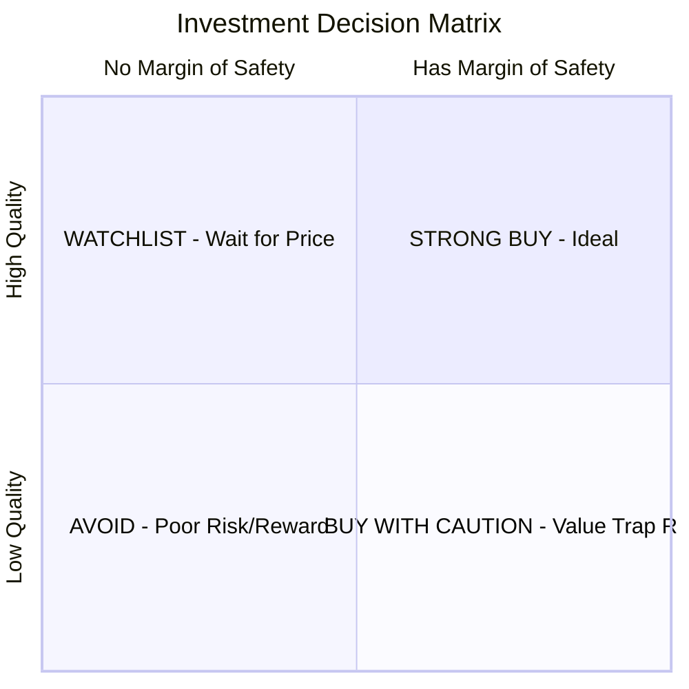
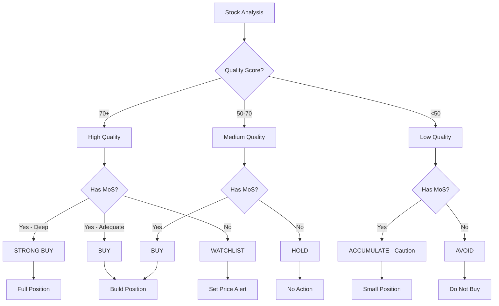

# MOSEE Decision Framework

## Core Philosophy

MOSEE's decision framework is built on a fundamental truth:

> **Quality affects what fair value IS. Margin of Safety determines WHETHER to buy.**
> 
> No matter how good the company is, you must still demand a margin of safety.

## The Decision Matrix



### Expanded Decision Matrix

|  | **Has MoS** | **No MoS** |
|---|-------------|------------|
| **High Quality (70+)** | **STRONG BUY** | **WATCHLIST** |
| | Buffett's ideal: wonderful company at wonderful price | Great company, but wait for better price |
| **Medium Quality (50-70)** | **BUY** | **HOLD** |
| | Good value, acceptable quality | Fair value, no action |
| **Low Quality (<50)** | **ACCUMULATE (Caution)** | **AVOID** |
| | Graham's "cigar butts" - risky | Poor quality AND expensive |

## Verdict Categories

### STRONG BUY
- Quality Score: 70+
- Margin of Safety: < 0.5 (price 50%+ below conservative value)
- **Action:** Full position, high conviction

### BUY
- Quality Score: 50+
- Margin of Safety: 0.5-0.7
- **Action:** Build position

### ACCUMULATE
- Quality Score: Any
- Margin of Safety: 0.7-1.0
- **Action:** Small position, add on weakness

### WATCHLIST
- Quality Score: 70+ (high quality)
- Margin of Safety: > 1.0 (no safety)
- **Action:** Monitor, set price alerts, wait for opportunity

### HOLD
- Quality Score: 50-70
- Margin of Safety: > 1.0
- **Action:** No action if owned, don't buy

### REDUCE
- Quality Score: < 50
- Margin of Safety: 1.0-1.5
- **Action:** Trim position if overweight

### SELL
- Quality Score: Any
- Margin of Safety: > 1.5 (significantly overvalued)
- **Action:** Exit position

### AVOID
- Quality Score: < 50
- Margin of Safety: > 1.0
- **Action:** Do not invest

## The Decision Flow



## Margin of Safety Thresholds

| MoS Ratio | Interpretation | Required Quality |
|-----------|----------------|------------------|
| < 0.5 | Exceptional value | Any |
| 0.5-0.7 | Good value | 50+ |
| 0.7-1.0 | Fair value with some buffer | 60+ |
| 1.0-1.2 | Full value, no safety | Watchlist only |
| 1.2-1.5 | Overvalued | Consider selling |
| > 1.5 | Significantly overvalued | Sell |

## The Google Example

Let's apply this to a company like Google:

```
GOOGLE (GOOGL) Analysis
========================

Quality Assessment:
- ROE: 25% → Excellent
- ROIC: 22% → Excellent  
- Moat: Strong (network effects, data)
- Growth: 15%+ revenue CAGR
- Quality Score: 85/100 (Grade: A)

Valuation Range:
- Conservative: $140
- Base: $175
- Optimistic: $210

Current Price: $175

Margin of Safety Check:
- MoS Ratio: $175 / $140 = 1.25
- Has MoS: NO (1.25 > 0.70)
- Buy Below: $140 × 0.7 = $98

VERDICT: WATCHLIST
- Excellent business (Quality: A)
- But NO margin of safety
- Wait for price below $98 for adequate MoS
- Or below $140 for minimal safety

ACTION ITEMS:
1. Add to watchlist
2. Set price alert at $98 (ideal entry)
3. Set price alert at $140 (consider entry)
4. Monitor quarterly for any quality deterioration
```

## Multi-Lens Perspective

Before reaching a final verdict, MOSEE considers how different investment philosophers would view the stock:

```
MULTI-LENS ANALYSIS: GOOGL @ $175
==================================

Graham (Value/Safety):
  Score: 45/100 (D)
  Verdict: EXPENSIVE
  "P/E of 28 exceeds Graham's 15x limit. No margin of safety."

Buffett (Quality):
  Score: 88/100 (A)
  Verdict: WONDERFUL BUSINESS
  "ROE 25%, ROIC 22%, strong moat. This is a quality company."

Lynch (GARP):
  Score: 75/100 (B)
  Verdict: FAIRLY PRICED
  "PEG of 1.1 is reasonable for this growth rate."

Fisher (Growth):
  Score: 82/100 (A)
  Verdict: EXCELLENT GROWTH
  "18% sales CAGR with expanding margins. Fisher would approve."

SYNTHESIS:
High quality company that Graham would avoid on price,
but Buffett, Lynch, and Fisher would appreciate on quality.
Verdict: WATCHLIST until price provides margin of safety.
```

## Action Items by Verdict

### STRONG BUY Actions
- [ ] Consider initiating full position
- [ ] Review position sizing relative to portfolio
- [ ] Set trailing stop if desired

### BUY Actions
- [ ] Consider building position in tranches
- [ ] Review entry points for additional buys
- [ ] Monitor for continued value

### WATCHLIST Actions
- [ ] Add to watchlist
- [ ] Set price alert at buy-below price
- [ ] Monitor quarterly results
- [ ] Reassess if price drops significantly

### HOLD Actions
- [ ] No action needed if owned
- [ ] Do not add at current prices
- [ ] Review at next earnings

### AVOID Actions
- [ ] Do not invest
- [ ] Remove from consideration
- [ ] Reallocate research time elsewhere

## Summary

1. **Quality determines the ceiling** - Higher quality = higher fair value
2. **MoS determines the entry** - Must buy below conservative value
3. **Never compromise on MoS** - Even for the best companies
4. **Multi-lens view** - Consider all perspectives before deciding
5. **Actionable output** - Clear verdicts with specific actions
