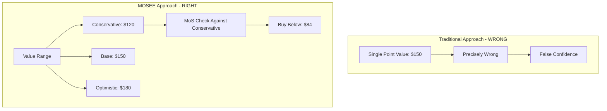
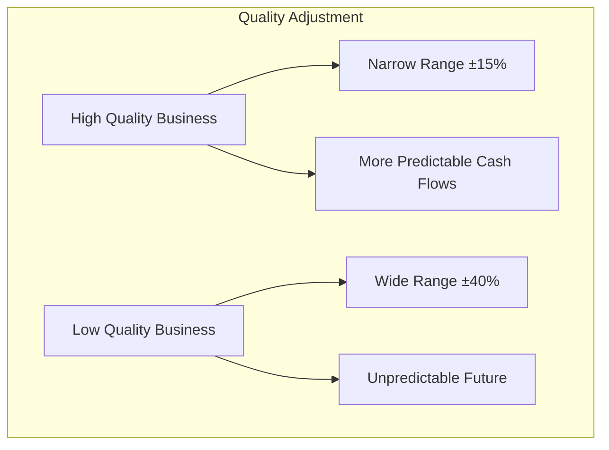
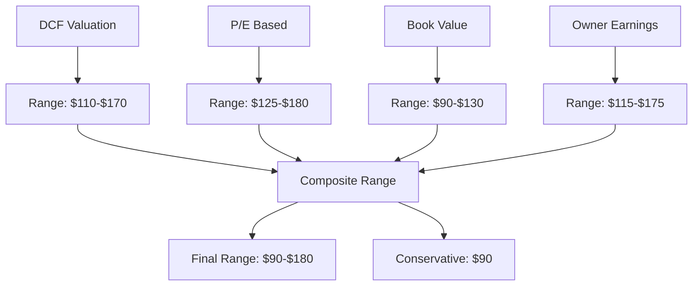

# Valuation Range Framework

## Core Principle

> "It's better to be approximately right than precisely wrong." - Warren Buffett

Intrinsic value is **never** a single precise number. It is always a range based on assumptions, estimates, and inherent uncertainty about the future.

## The Problem with Single-Point Valuations



When analysts say "fair value is $150," they imply precision that doesn't exist. The reality:
- Conservative scenario might yield $120
- Base case might yield $150
- Optimistic scenario might yield $180

**MOSEE acknowledges this uncertainty and builds it into the system.**

## The Range-Based Valuation Model

### Valuation Range Structure

```
                    ◄──── Uncertainty Range ────►
                    
    $80        $120        $150        $180        $220
     │          │           │           │           │
     ▼          ▼           ▼           ▼           ▼
  ┌─────┬───────────┬───────────┬───────────┬─────┐
  │BEAR │CONSERVATIVE│   BASE    │ OPTIMISTIC│BULL │
  └─────┴───────────┴───────────┴───────────┴─────┘
                          │
                    "Most Likely"
                    
  MoS Entry Point: Buy below CONSERVATIVE value ($120 × 0.7 = $84)
  Not the base case!
```

### Three Scenarios

| Scenario | Description | Use |
|----------|-------------|-----|
| **Conservative** | Pessimistic assumptions: lower growth, higher discount rate, problems occur | **Margin of Safety baseline** |
| **Base** | Expected/most likely assumptions | Fair value reference |
| **Optimistic** | Best-case assumptions: higher growth, execution goes well | Upside potential |

## Quality Affects Range Width

A key insight: **the quality and predictability of a business affects how wide the valuation range should be.**



### Range Width by Quality Score

| Quality Score | Uncertainty Factor | Example Range |
|---------------|-------------------|---------------|
| 80+ (High) | ±15% | $127 - $173 |
| 60-79 (Medium) | ±25% | $112 - $188 |
| 40-59 (Low) | ±35% | $97 - $203 |
| <40 (Poor) | ±50% | $75 - $225 |

**Why?** A company like Coca-Cola with consistent earnings is easier to value than a speculative biotech. The range should reflect this.

## Margin of Safety: The Non-Negotiable Gate

### Key Principle

**Margin of Safety is always measured against the CONSERVATIVE end of the range, not the base case.**

```
Conservative Value: $120
Required MoS: 30% (ratio of 0.7)
Buy Below Price: $120 × 0.7 = $84

Current Price: $100
MoS Ratio: $100 / $120 = 0.83
Verdict: NO margin of safety (0.83 > 0.70)
```

### Why Conservative, Not Base?

If we used base case:
- We're assuming everything goes as expected
- No buffer for errors in our assumptions
- No protection if pessimistic scenario occurs

Using conservative case:
- We're protected if things go wrong
- If base case occurs, we get bonus returns
- If optimistic case occurs, we get exceptional returns

## Multiple Valuation Methods

MOSEE triangulates using multiple methods, each producing its own range:



### Composite Range Calculation

1. **Conservative:** Take the LOWEST conservative value across methods
   - Provides maximum safety
   
2. **Base:** Weighted average of base values
   - Higher confidence methods get more weight
   
3. **Optimistic:** Average of optimistic values
   - Not the highest (avoid anchoring to best case)

## Implementation

### ValuationRange Class

```python
@dataclass
class ValuationRange:
    conservative: float      # Bear case - USE THIS FOR MoS
    base: float             # Most likely
    optimistic: float       # Bull case
    method: str             # Which valuation method
    confidence: ValueConfidence
    
    def margin_of_safety(self, current_price: float) -> float:
        """MoS against CONSERVATIVE value."""
        return current_price / self.conservative
    
    def is_buyable(self, current_price: float, required_mos: float = 0.7) -> bool:
        """Check if stock has adequate margin of safety."""
        return self.margin_of_safety(current_price) <= required_mos
    
    def buy_below_price(self, required_mos: float = 0.7) -> float:
        """Maximum price to pay for required MoS."""
        return self.conservative * required_mos
```

### Creating Ranges

```python
from MOSEE.valuation_range import (
    create_dcf_range,
    create_earnings_range,
    create_book_value_range,
    build_composite_valuation
)

# Build comprehensive valuation
valuation = build_composite_valuation(
    ticker="AAPL",
    metrics=calculated_metrics,
    quality_score=75
)

# Get verdict
verdict = valuation.get_verdict(current_price=185.00)
print(verdict['insight'])
# "Priced at or above base value. Current $185 offers no margin of safety.
#  Wait for pullback to $126 or below. Value range: $120-$200."
```

## Scenario Analysis for DCF

When calculating DCF ranges, we vary the key assumptions:

| Parameter | Conservative | Base | Optimistic |
|-----------|-------------|------|------------|
| Cash Flow | -10% | As projected | +10% |
| Growth Rate | 70% of estimate | Estimate | 120% of estimate |
| Discount Rate | +2% | Estimate | -1% |
| Terminal Growth | 80% of estimate | Estimate | 110% of estimate |

This creates a natural range that reflects uncertainty in key drivers.

## Summary

1. **Value is a range** - Always think in terms of conservative/base/optimistic
2. **Quality narrows the range** - Predictable businesses are easier to value
3. **MoS against conservative** - Never compromise on margin of safety
4. **Multiple methods** - Triangulate to get robust range
5. **Acknowledge uncertainty** - It's intellectually honest and protective
